# Homelab Setup Protocol
works as my detailed steps description and a small instruction for future reference

## Setup description
- Windows 11 with a localuser setup
- Ubuntu Server with apache and wazuh
- OpenBSD 7.8 setup with pf files as main firewall

### OpenBSD Setup (09.03.2026) - Replaced, kept for reference
- Install OpenBSD and setup a singular root user
- Setup 2 Network Adapters one set to NAT other one set to Internal Network

##### Ifconfig output before the setup

#### 1. Assign static IP to LAN interface
- echo 'inet 192.168.1.1 255.255.255.0' > /etc/hostname.em1

#### 2. Set em0/WAN interface to DHCP
- echo 'dhcp' > /etc/hostname.em0

#### 3. Enable IP forwarding
- echo 'net.inet.ip.forwarding=1' >> /etc/sysctl.conf

#### 4. Setup simple Pf rules for the beginning
- you can see my pf.conf below in the setup directory/folder

#### 5. Enable and load PF and make it start on Boot
- pfctl -e 
- pfctl -f /etc/pf.conf
- rcctl enable pf

#### 6. If config output after the setup

### Ubuntu Server Setup (10.03.2026)
- Setup ubuntu server and modify /etc/netplan/00-installer-config.yaml as follows(visible in the setup files)
- Change Network Adapter of the VM (see picture below)
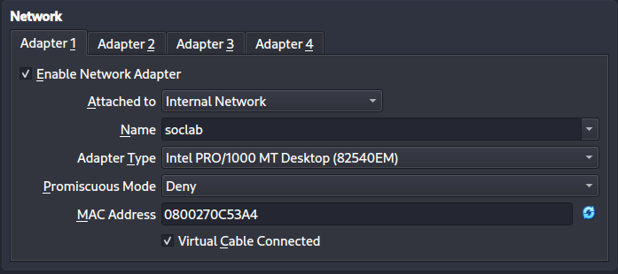
- Ran into a problem, Ubuntu Server VM no longer boots properly
    - try to boot through recovery with GRUB
    - successful
- after a quick search i found that its VirtualBox console issue fixable by Right Ctrl + F1/F2/F3
- ip a output after the setup
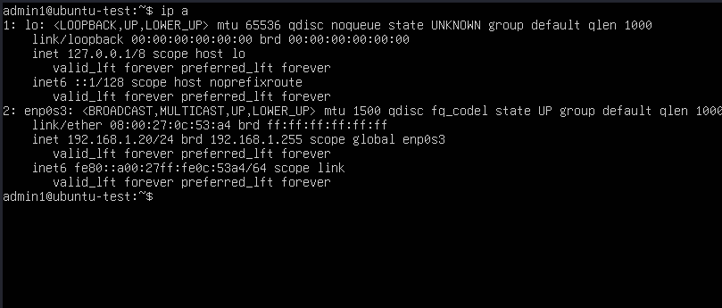
- Download wazuh with help of curl -sO https://packages.wazuh.com/4.14/wazuh-install.sh (ensure the O in curl is capital letter o and not a zero)
- install wazuh with sudo bash ./wazuh-install.sh -a
- save given credentials

### Win11 Client Setup (10.03.2026)
- Setup Windows 11 with a local user setup via Microsoft account bypass 
- Change Network Adapter of the VM
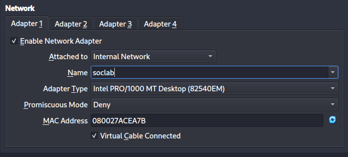
- in Network & Internet, change Ethernet to Manual IP with
    - IP: 192.168.1.10
    - Subnet mask: 255.255.255.0
    - Gateway: 192.168.1.1
    - DNS: 8.8.8.8
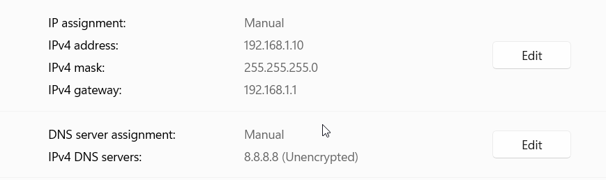
- test connection by pinging the gateway and Internet(8.8.8.8 in this case)
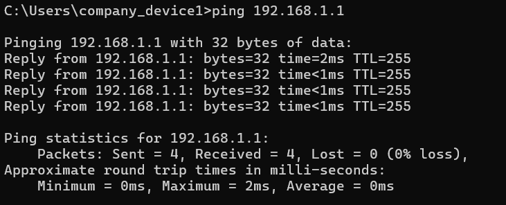

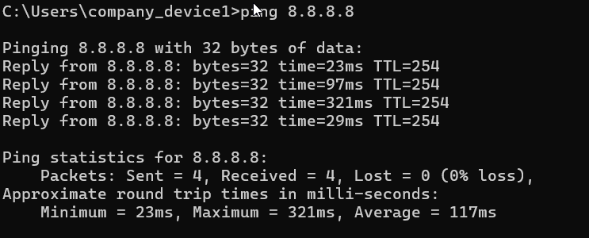
- The setup Works, now we try to Access Wazuh to check if wazuh set up correctly
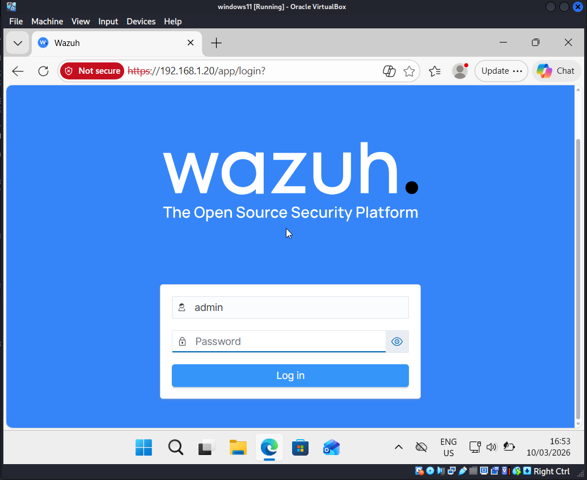
- Try and Login to ensure that credentials are correct and Wazuh is working
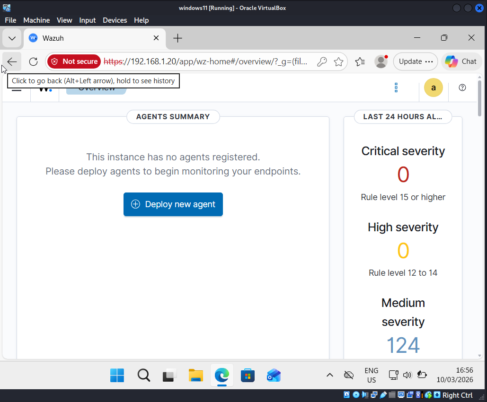
- It works
- install sysmon and Wazuh agent on win11
- install sysmon off official Microsoft Sysinternals and setup the SwiftOnSecurity config of Github
    - Run PowerShell as administrator and run
        - .\Sysmon64.exe -accepteula -i sysmonconfig-export.xml
        - as i installed it incorrectly, i had to update with .\Sysmon64.exe -c sysmonconfig-export.xml
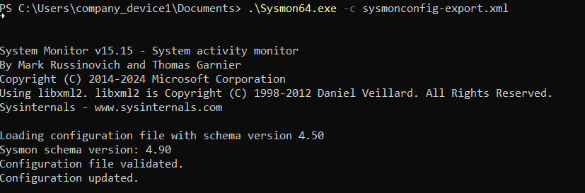
- For wazuh follow instructions on the local host website
- Successful agent installation
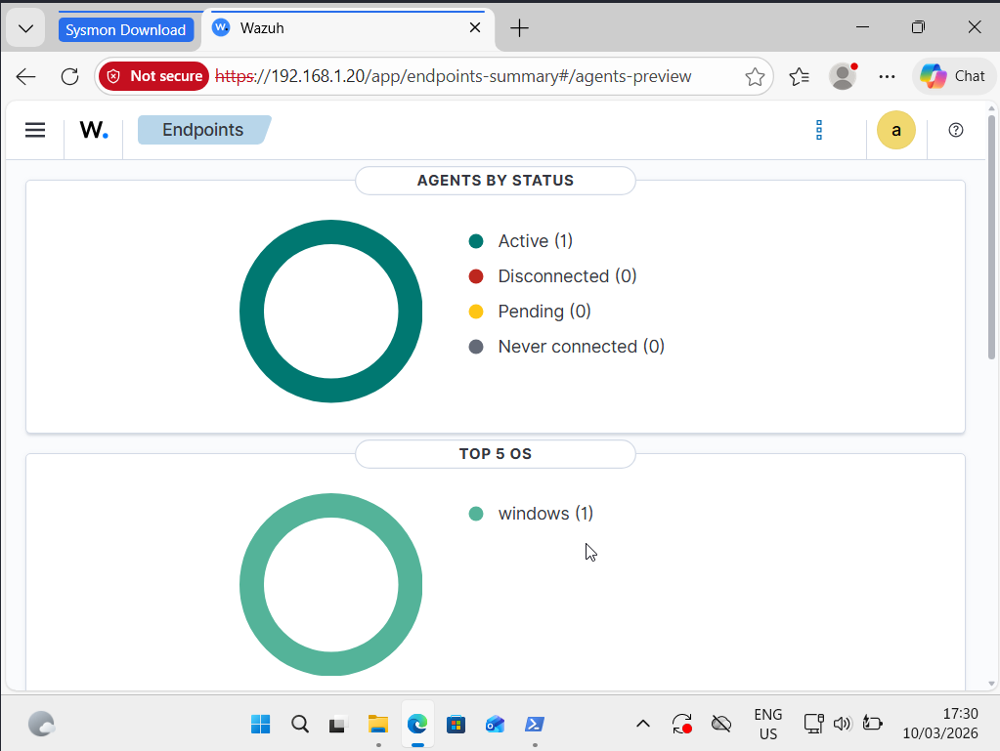

### New gateway setup pfSense Community edition (10.03.2026)
- I decided to replace OpenBSD with pfSense
- Decision was based upon pfSense having more similarities to Enterprise environments and an easier log forwarding
- Download pfSense Community edition off Netgate website
- Setup pfSense similarly with 2 Network Adapters
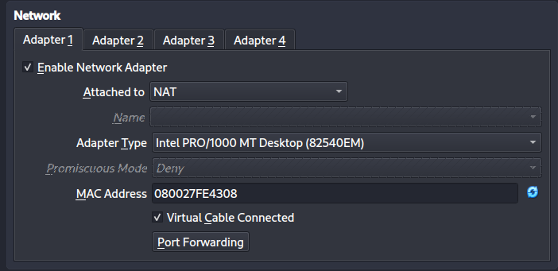
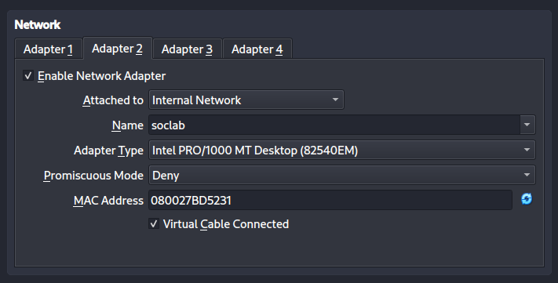
- Install the OS itself and choose WAN for interface em0 and LAN for interface em1
- Reboot the VM
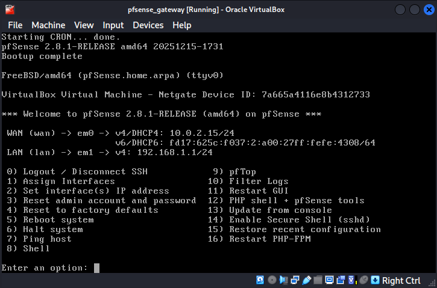
- from Win11 access pfSense local website on 192.168.1.1
- Change the default password in System -> User Manager -> Admin -> Change password
- Setup of the OS is finished
- Setup Log Forwarding
    - go to Status -> System Logs -> Settings
    - scroll down to Remote logging and enable it
    - set 192.168.1.20 on port 514 for Remote log Server
- On Ubuntu Server
    - edit ossec.conf and add new remote listening
    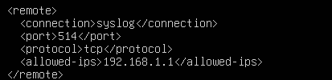
    - restart the service
        - sudo systemctl restart wazuh-manager

