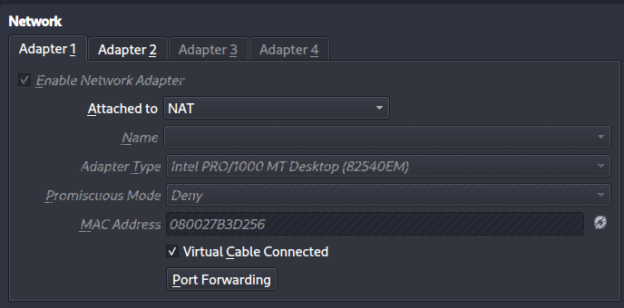
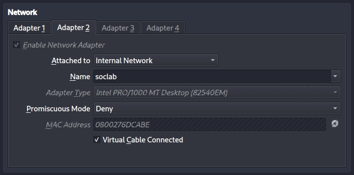
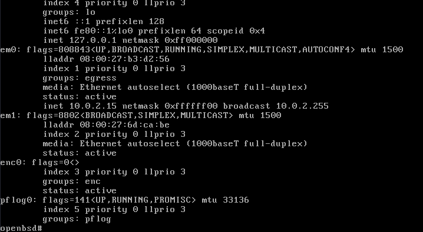
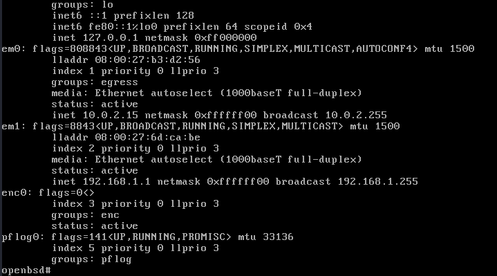

# Homelab Setup Protocol
works as my detailed steps description and a small instruction for future reference

## Setup description
- Windows 11 with a localuser setup
- Ubuntu Serve with apache and wazuh
- OpenBSD 7.8 setup with pf files as main firewall

### OpenBSD Setup (09.03.2026)
- Install OpenBSD and setup a singular root user
- Setup 2 Network Adapters one set to NAT other one set to Internal Network

##### Ifconfig output before the setup

#### 1. Assign static IP to LAN interface
- echo 'inet 192.168.1.1 255.255.255.0' > /etc/hostname.em1

#### 2. Set em0/WAN interface to DHCP
- echo 'dhcp' > /etc/hostname.em0

#### 3. Enable IP forwarding
- echo 'net.inet.ip.forwarding=1' >> /etc/sysctl.conf

#### 4. Setup simple Pf rules for the beginning
- you can see my pf.conf below in the setup directory/folder

#### 5. Enable and load PF and make it start on Boot
- pfctl -e 
- pfctl -f /etc/pf.conf
- rcctl enable pf

#### 6. If config output after the setup

