# Active Directory Setup
a detailed how to Active Directory setup from my perspective with all necessary screenshots and configf

## First Steps
- download the windows server iso off Microsoft official website
- i chose the 2025 version, as its the newest one and endorsed to use by Microsoft
- after iso is downloaded onto our machine, we can create the machine in virt-manager
- we assign 4 CPU cores and at least 6gb memory to the machine, as windows manager is heavy reliant on resources
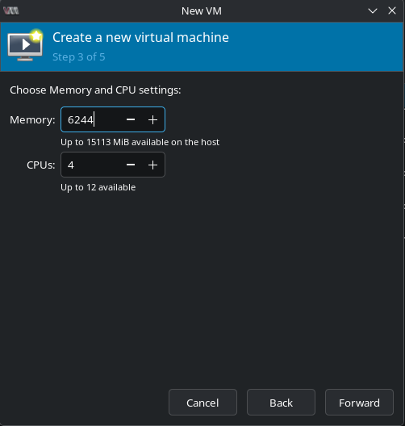
- also we assign size for the disk image, minimum is at 32gb i will be assigning 40gb
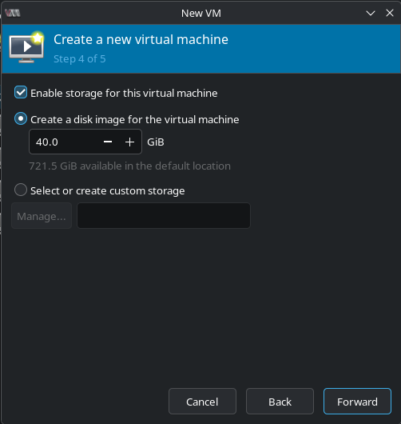
- also we change Cache mode in out disk to none for security and performance reasons
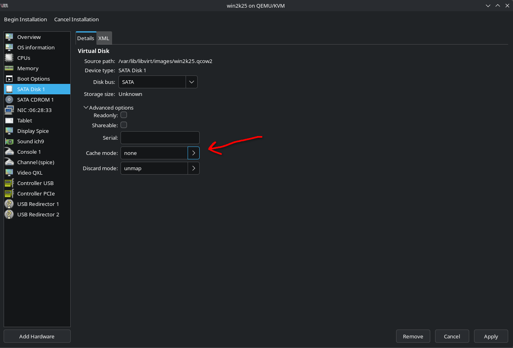
- we start installation, set language we would like to install
    - english in my case
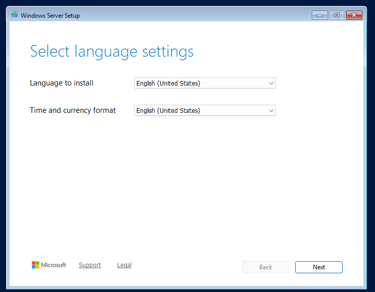
- at the image type, i select a headless standard evaluation
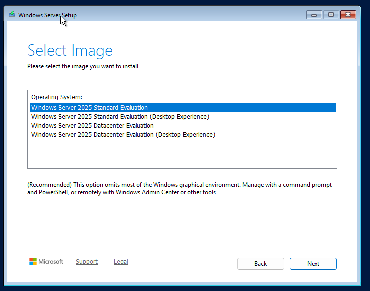
- and lastly we choose our 40gb partition for installation location
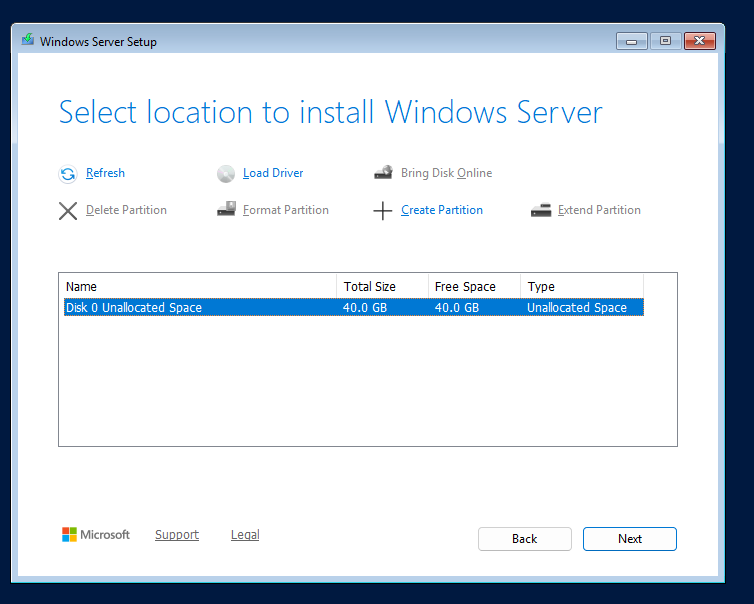
- then we proceed with installation
- we setup password and proceed into Command Line of the server by typing 15
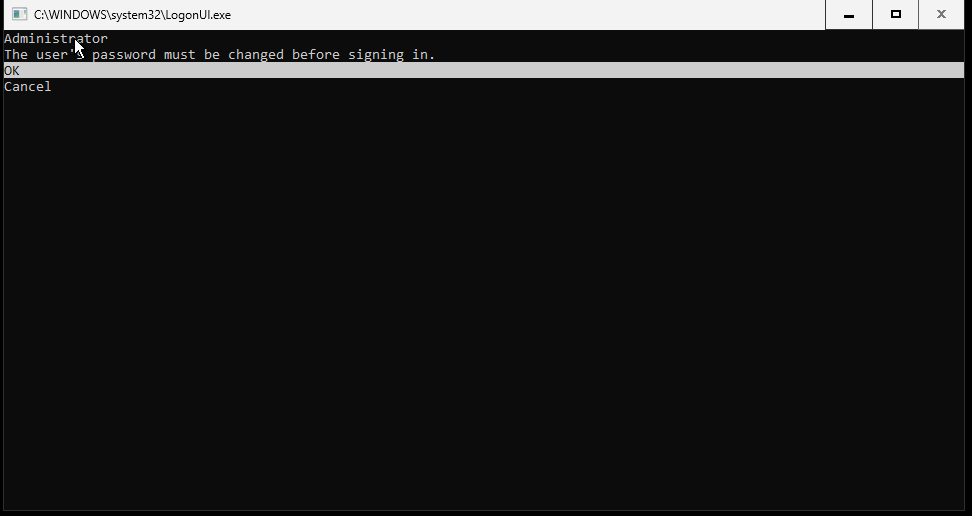
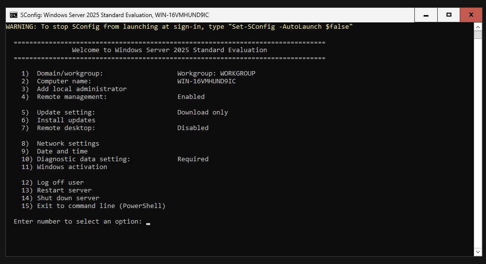
- first we lookup Interface indexes with 
    - Get-NetAdapter to set a static ip afterwards
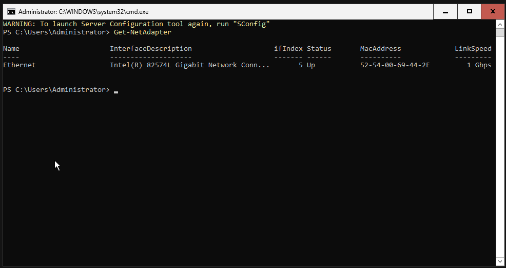
- We have a singular ethernet or our lan-lab network on index 5
- we set static ip to this index
    - with New-NetIPAddress -InterfaceIndex 5 -IPAddress 192.168.1.40 -PrefixLength 24 -DefaultGateway 192.168.1.1
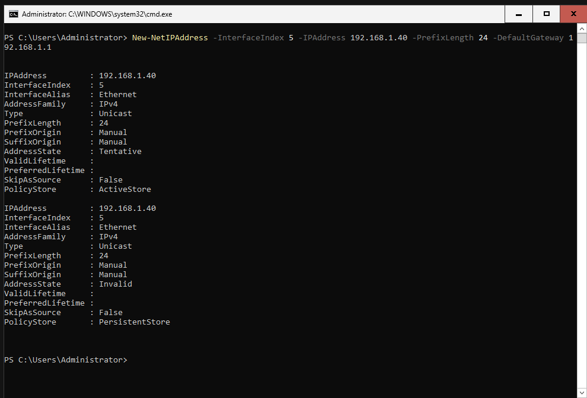
- and we also set the DNS to loop into itself
    - with Set-DnsClientServerAddress -InterfaceIndex 5 -ServerAddress 127.0.0.1
- we install Active Directory Domain Services
    - with Install-WindowsFeature -Name AD-Domain-Services -IncludeManagementTools
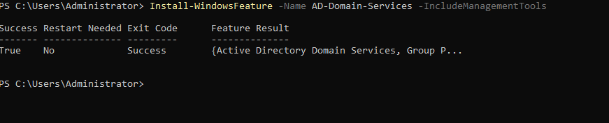

